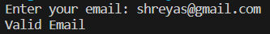
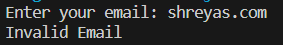

    

# Python Projects Showcase 🐍

Welcome to my collection of Python projects! This repository showcases a variety of projects I've developed using Python. Each project comes with a brief description, an image, and a link to its repository for more details.

Feel free to explore, learn, and contribute!

## Projects

<!-- Desktop Notifier -->

    <h3><a href="link_to_desktop_notifier">Desktop Notifier</a></h3>
    

<!-- Digital Clock -->

    <h3><a href="link_to_digital_clock">Digital Clock</a></h3>
    

<!-- Email Validation -->

    <h3><a href="link_to_email_validation">Email Validation</a></h3>
    
    

<!-- ... Repeat for other projects ... -->

## Get Involved

If you find any of these projects interesting or helpful, consider contributing, starring the repository, or sharing it with others. Your feedback is highly appreciated!

## Contact

Feel free to connect with me on [LinkedIn](https://www.linkedin.com/in/yourusername/) or [Twitter](https://twitter.com/yourusername).

Happy coding! 😄
