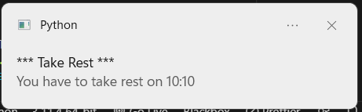
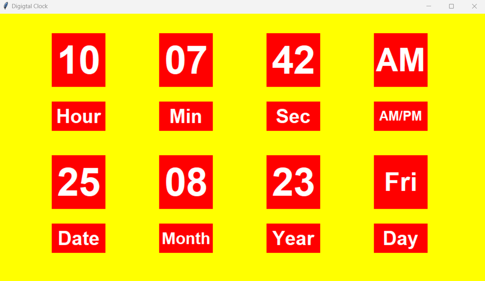

    

# Python Projects Showcase 🐍

Welcome to my collection of Python projects! This repository showcases a variety of projects I've developed using Python. Each project comes with a brief description, an image, and a link to its repository for more details.

Feel free to explore, learn, and contribute!

## Projects

<!-- Desktop Notifier -->

    <h3><a href="./Desktop Notifier/">Desktop Notifier</a></h3>
    

<!-- Digital Clock -->

    <h3><a href="./Digital Clock/">Digital Clock</a></h3>
    

<!-- Email Validation -->

    <h3><a href="./Email Validation/">Email Validation</a></h3>
    
    

<!-- Google Translate -->

    <h3><a href="./Google Translator/">Translator</a></h3>
    

<!-- Internet Speed Test -->

    <h3><a href="./Internet Speed Test/">Internet Speed Test</a></h3>
    

<!-- Phone Number Details -->

    <h3><a href="./Phone Number Details/">Extract Phone Number Details</a></h3>
    

<!-- QR Code Generator -->

    <h3><a href="./QR Code Generator/">QR Code Generator</a></h3>
    

<h4 align="center">Qr Code for Youtube</h4>

    <h3><a href="./Convert Python file to exe/">Convert Python File to exe</a></h3>

    <h3><a href="./Gmail Automate/">Gmail Automate</a></h3>

    <h3><a href="./Instagram Automation using Python/">Automate Your Instagram</a></h3>

    <h3><a href="./Python file to Android App/">Convert Python File to Android App</a></h3>

    <h3><a href="./Screen Recorder/">Screen Recorder</a></h3>

    <h3><a href="./Shut Down App/">Shut Down App</a></h3>

    <h3><a href="./Typing Speed Calculator/">Typing Speed Calculator</a></h3>

    <h3><a href="./Website Blocker/">Website Blocker</a></h3>

    <h3><a href="./Youtube Video Downloader/">Youtube Video Downloader</a></h3>

    <h3><a href="./Voice Assistant/">Voice Assistant</a></h3>

    <h3><a href="./Text To Handwritting/">Text to Handwriting</a></h3>

<!-- ... Repeat for other projects ... -->

## Get Involved

If you find any of these projects interesting or helpful, consider contributing, starring the repository, or sharing it with others. Your feedback is highly appreciated!

## Contact

Feel free to connect with me on [LinkedIn](https://www.linkedin.com/in/shreyas-pachpute-b5882a204/) or [Twitter](https://twitter.com/yourusername).

Happy coding! 😄
